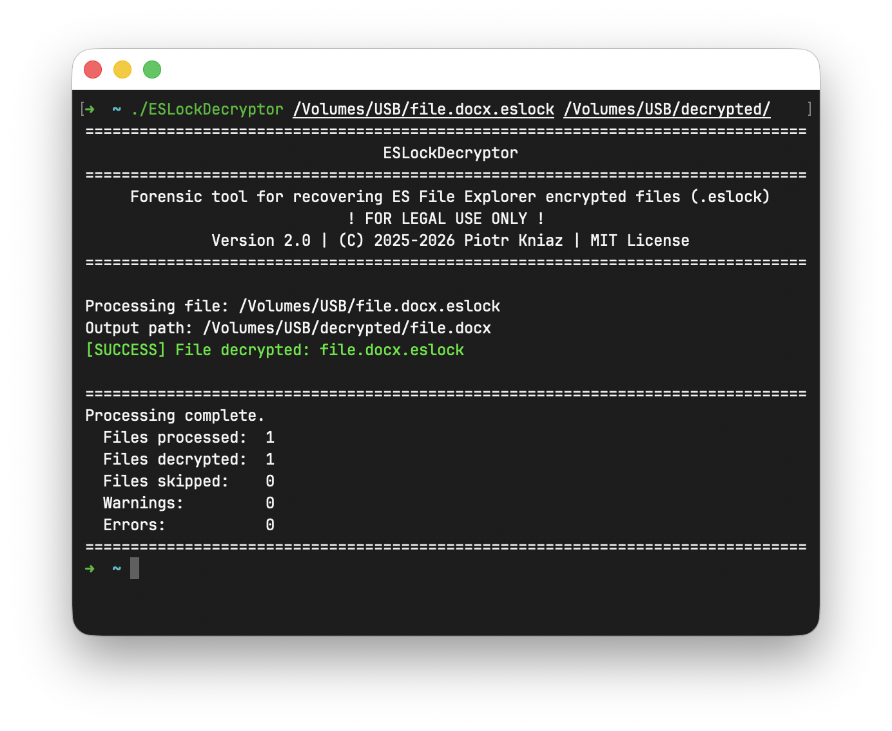

# ESLockDecryptor

[](https://packetstorm.news/files/id/213316/) [](https://cxsecurity.com/issue/WLB-2025120027)


**ESLockDecryptor** is a command-line tool designed to recover and decrypt files encrypted by ES File Explorer (files with the `.eslock` extension). It supports processing both individual files and entire directories.

> [!WARNING]
> **FOR LEGAL USE ONLY!** This software is designed for **educational purposes, security research, and lawful digital forensics use**. It is intended to help users recover their own data or to assist authorized professionals in analyzing artifacts/evidence.
> 
> The author is not responsible for any illegal use of this tool. Usage of this software for attacking targets without prior mutual consent is illegal. It is the end user's responsibility to obey all applicable local, state, and federal laws. Developers assume no liability and are not responsible for any misuse or damage caused by this program.

<div align="center">

[](https://github.com/Piotr-Kniaz/ESLockDecryptor/releases/latest)

[](https://github.com/Piotr-Kniaz/ESLockDecryptor/releases)



</div>

## Features

*   **Batch Processing:** Decrypt entire directories containing `.eslock` files.
*   **Single File Mode:** Decrypt specific files.
*   **Auto-Detection:** Automatically detects input/output paths if not specified.
*   **Fast and Lightweight:** Simple CLI interface, parallel decryption of multiple files.
*   **Heuristic Mode:** If the file cannot be decrypted using the standard method, heuristic analysis can be used.
*   **Raw Decryption Mode:** If the file is severely corrupted, it can try to partially recover the file using default parameters.

## Downloads & Supported Platforms

You can download the latest pre-built binaries for your system from the **[Releases](../../releases)** page.

<div align="center">

[](https://github.com/Piotr-Kniaz/ESLockDecryptor/releases/latest)

</div>

*.NET Runtime installation is **not required**.*

**Supported Platforms:**
*   **Windows:** x64, x86, Arm64
*   **Linux:** x64, Arm64
    *(tested on Ubuntu, Fedora, Kali; compatible with Debian, Arch, Mint, openSUSE, and other glibc-based distributions)*
*   **macOS:** Arm64 (Apple Silicon), x64 (Intel)

## How to Run *(Important)*

**This is a Command Line Interface (CLI) tool.** It is meant to be executed from a terminal (Command Prompt, PowerShell, Bash).

**Do not run by double-clicking:**
*   **Windows:** The terminal window will close immediately after the process finishes, preventing you from seeing the success/error logs.
*   **Linux:** The process may run in the background with no visual feedback, making it unclear if the decryption finished.

**Correct way:**
1.  Open your Terminal.
2.  Navigate to the folder containing the tool (`cd path/to/tool`).
3.  Run the command as shown below.


## Usage

```bash
ESLockDecryptor [<input> [<output>]] [options]
```

### Directory Logic

All directories are processed **recursively**. The output directory will have the same structure as the input directory.

If the `<output>` argument is omitted (Scenarios 1 & 2), the utility automatically creates a new directory in the current working location using the format:
`decrypted-[timestamp]`
*(e.g., `decrypted-20260214-231500`)*


### Basic scenarios

#### 1. Auto-mode (Current Folder)
**Requirement:** Place the `ESLockDecryptor` executable **directly inside** the folder containing the encrypted `.eslock` files.
```bash
./ESLockDecryptor
```
*The tool will scan the current directory and save decrypted files to a new timestamped folder. Result location: `./decrypted-[timestamp]`*


#### 2. Specific Input (Auto-Output)
Specify the path to the directory containing encrypted files. The output folder (`decrypted-[timestamp]`) will be created **beside the specified directory**.
```bash
./ESLockDecryptor "path/to/encrypted_directory"
```
*Result location: `path/to/decrypted-[timestamp]`*

If a file is specified, the output directory will be created **beside the file**.
```bash
./ESLockDecryptor "path/to/file.eslock"
```
*Result location: `path/to/decrypted-[timestamp]`*

#### 3. Explicit Input and Output
Specify exactly where to take files from and where to save the decrypted versions.
```bash
./ESLockDecryptor "encrypted/path" "decrypted/path"
```
*If the output directory is not exists, it will be created.*

### Options

Main flags:

- `--verbose` or `-v`. Print detailed log.
- `--overwrite`. Overwrite file if it already exists in the output directory.
- `--read-only`. Only read and print metadata (no decryption).

If the file is corrupted, additional flags can be used:
- `--ignore-crc`. Continue even if checksum verification fails.
- `--password <password>` or `-p <password>`. Use the provided password for decryption, ignore key from metadata.
- `--key <key>` or `-k <key>`. Use the provided key for decryption, ignore key from metadata.
- `--heuristic`. Heuristic metadata search and parse.
- `--raw-decrypt <auto|full|partial[:size]>`. Ignore metadata and decrypt the file with the provided key or password.

Learn more [How to use ESLockDecryptor](HOW-TO-USE.md).

## Building from Source

If you prefer to build the application yourself, ensure you have the **.NET 10 SDK** installed.

1.  Clone the repository:
    ```bash
    git clone https://github.com/Piotr-Kniaz/ESLockDecryptor.git
    cd ESLockDecryptor
    ```
2.  Build the project:
    ```bash
    dotnet build --configuration Release
    ```

## Issues & Contributing

**Contributions are welcome!** If you found a bug, have a feature request, or want to improve the code, feel free to help.

## License

This project is licensed under the **MIT License**.
